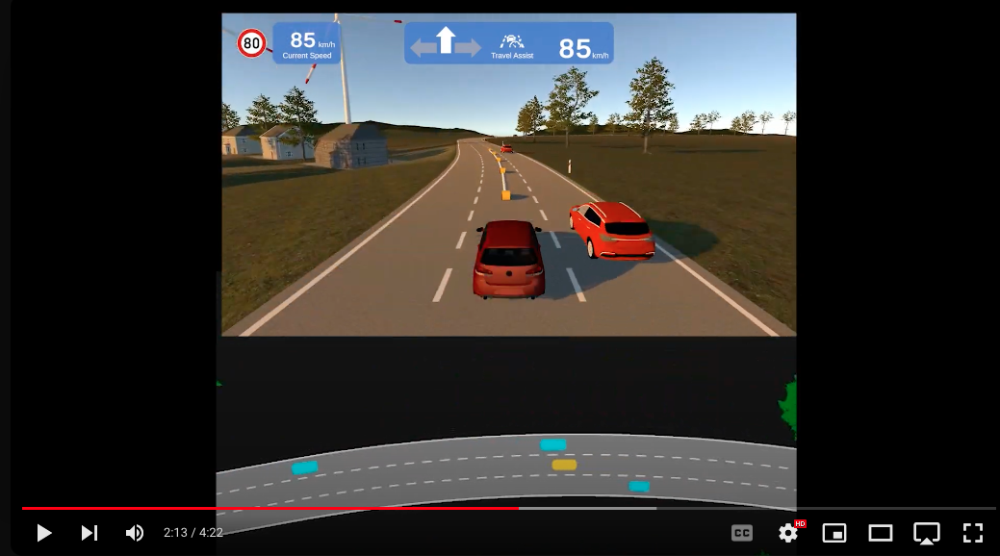

# SwapTransformer: Highway Overtaking Tactical Planner Model via Imitation Learning on OSHA Dataset 

[Arxiv Paper](http://arxiv.org/abs/2401.01425)
<br />
SwapTransformer investigates the high-level decision-making problem in highway scenarios regarding lane changing and over-taking other slower vehicles. In particular, SwapTransformer aims to improve the Travel Assist feature for automatic overtaking and lane changes on highways. 9 million samples including lane images and other dynamic objects are collected in simulation. This data; Overtaking on Simulated HighwAys (OSHA) dataset is released to tackle this challenge. To solve this problem, an architecture called SwapTransformer is designed and implemented as an imitation learning approach on the OSHA dataset. The problem definition of this research can be summarized in the Figure below:
<br />
<br />

<br />
<!--  -->
<br />
<br />

SwapTransformer architecture is demonstrated in Figure below. This architecture includes main tasks and auxiliary tasks. Those main tasks (lane change action and ego speed) directly interact with the travel-assist controller. Those auxiliary tasks including future trajectory estimation and the CarNetwork matrix are used as benefits for the model to better understand the agents' interactions and future decision-making. The swapping feature for the core part of the model is explained in the paper in more detail.

<br />
<!--  -->


<br />


## 🛠️ Requirements
To run different parts of this repo, there is a requirement list for the Python packages which are included in the requirement.txt file. Keep in mind that all packages are tested on Python 3.8.0 and Ubuntu 20.04 and 22.04.
To install all packages in your conda environment, simply create a new environment and install the packages.

```sh
conda create --name env_swaptransformer python==3.8.0 -y
conda activate env_swaptransformer
pip install -r requirement.txt
```

If you prefer to work with a prepared environment and container, a [Dockerfile](Dockerfile) is written for that.

## ⌛ Data Collection
The data collection phase is done based on a rule-based driver. The rule-based driver is designed on top of the Sumo and Unity engine. For more information about the data collection, please read the paper.


## 📖 Dataset
The table below shows some details about the dataset collected based on the rule-based driver. Both raw and pre-processed data are mentioned here.
More information about the dataset is available in the paper and [OSHA Dataset on IEEE Dataport](https://ieee-dataport.org/documents/osha-dataset-overtaking-simulated-highways).
<!-- <br />
<br />
 -->
<!-- <br /> -->
<br />

|  Description | Raw Data | Processed Data|
| ------------ | ------------ | ------------ |
| Number of pickle files | 900 | 1 |
| Pickle file size (single) | 34.1 MB | 61 GB |
| Image size | 5.7 MB (episode) | 35 GB |
| Total number of samples | 8,970,692 | 8,206,442 |
| Lane change commands | 5,147 | 69,119 |
| Left lane commands | 2,648 | 35,859 |
| Right lane commands | 2,499 | 33,260 |
| Transition commands | 0 | 1,468,115 |
| Number of episodes | 900 | 834 |
| Samples per episode | 10,000 | 9,839 (Average) |
| Speed limit values | {30, 40, ..., 80} (km/h) | {30, 40, ..., 80} (km/h) |
| Ego speed range | [0, 79.92] (km/h) | [0, 79.92] (km/h) |

<br />


## Running SwapTransformer
Any user can run pre-processing and training to play with the OSHA dataset and this repo. 

A reference of all arguments is available in [argparser.py](utils/argparser.py).


### 🧮 PREPROCESS
[OSHA Dataset on IEEE Dataport](https://ieee-dataport.org/documents/osha-dataset-overtaking-simulated-highways) shares more information about the pre-processing phase and how raw data is different than the pre-processed data. The appendix section in the paper also gives more information for pre-processing.
The pre-processed data is already shared on [OSHA Dataset on IEEE Dataport](https://ieee-dataport.org/documents/osha-dataset-overtaking-simulated-highways); however, a user can do the pre-processing on raw data.
The arguments below can be useful for the pre-processing:

```python
python prog_caller.py   --proc PREPROCESS \
                        --initials <YOUR_INITIALS> \
                        --milestone ML \
                        --task PREPROCESS \
                        --rawdata-path <PATH TO RAW DATA>
                        --processeddata-path <PATH TO SAVE PROCESSED DATA>
                        --sim-steptime 20 \
                        --pose-steptime 500 \
                        --num-poses 5 \
                        --add-lane-changes 5 \
                        --car-network \
                        --compress \
                        --compresseddata-path <PATH TO SAVED COMPRESSED DATA>
                        --compress-name <COMPRESSED NAME.tar.gz>
                        --multiprocess \
                        --num-processes 64
```


### 🧠 TRAIN
Pytorch lightning is also considered for parallel training and distributed data processing. However, it is possible to train without lightning.

To run regular training:
```python
python prog_caller.py   --proc TRAIN \
                        --initials <YOUR_INITIALS>  \
                        --milestone ML \
                        --task Training \
                        --bezier \
                        --carnetwork \
                        --travelassist-pred \
                        --img-height 100 \
                        --img-width 50 \
                        --algo BC \
                        --training-df-path <TRAINING PICKLE FILE PATH> \
                        --training-image-path <IMAGES TRAINING PATH> \
                        --validation-df-path <VALIDATION PICKLE FILE PATH> \
                        --validation-image-path <IMAGES VALIDATION PATH> \
                        --dim-input-feature 6 \
                        --num-epoch 300 \
                        --batch-size 256 \
                        --val-starting-epoch 5 \
                        --encoder resnet18 \
                        --lr-bc 0.0001 \
                        --residual \
                        --base-model transformer \
                        --track \
                        --wandb-entity <WANDB ENTITY> \
                        --save-model \
                        --model-path <PATH TO SAVE MODEL>
                        --model-saverate 10 \
                        --num-workers 4
```

To run training with Pytorch lightning:

* Replace `--proc TRAIN` with `--proc LIGHTNING`.
* Replace `--task Training` with `--task Training_lightning`.
* Add `--num-gpus 8` to the argument list above.
* If you have issues with GPU memory, you may lower your batch size (`--batch-size 256`).
* If you have issues with Pytorch distributed/parallel data processing, you may pass `0` workers to `--num-workers`.
* If you are not using WandB for logging, you may remove `--track` and `--wandb-entity` from args.
* For more information about training, please refer to the training section of [argparser.py](utils/argparser.py).

<br />

```python
python prog_caller.py   --proc LIGHTNING \
                        --num-gpus 8
```

### 📈 INFERENCE
To evaluate inference, different baselines and the proposed approach were run on 50 different episodes for comparison. These 50 episodes of testing and inference have different traffic behavior. The table below shows some of the results:

<br />
<!--  -->


<br />

<!-- |  Metrics | 1) Speed difference (m/s) ↓  | 2) Time to finish (s) ↓ | 3) Left overtake ratio ↑ | 
| ------------ | ------------ | ------------ | ------------ |
| Traffic | Low  Med High | Low Med High | Low Med High |
|  | 3.19 ± 0.7 4.16 ± 0.98 4.37 ± 0.77  |  |  |
|  |  |  |  |
|  |  |  |  |
|  |  |  |  |
|  |  |  |  | -->

## 🎥 🚗 Demos
The grid below shows how the simulation looks like when the SwapTransformer controls the ego vehicle. Those future pose estimations are shown in each image.
<br />
<!--  -->


<br />

https://github.com/VWIECCResearch/Swaptransformer/assets/152555117/3adb7d63-74d9-4fae-8d88-d513fd6ed9cf

https://github.com/VWIECCResearch/Swaptransformer/assets/152555117/08d3c0c2-c382-44dc-b885-738b92677f15

More videos and top-view perspectives from inference are available in the video below:

<br />

[](https://youtu.be/gNKsLh06eAg?si=w2V5SNR1NZkN2nqC "Sample video")


## 🔖 Citation

If you find this work useful, please cite our paper as follows:
<br />
```
@article{SwapTransformer2024,
  title={SwapTransformer: Highway Overtaking Tactical Planner Model via Imitation Learning on OSHA Dataset },
  author={Shamsoshoara, Alireza and Salih, Safin and Aghazadeh, Pedram},
  journal={Arxiv},
  pages={XXX YYYY},
  year={2024},
  publisher={Arxiv}
}
```
